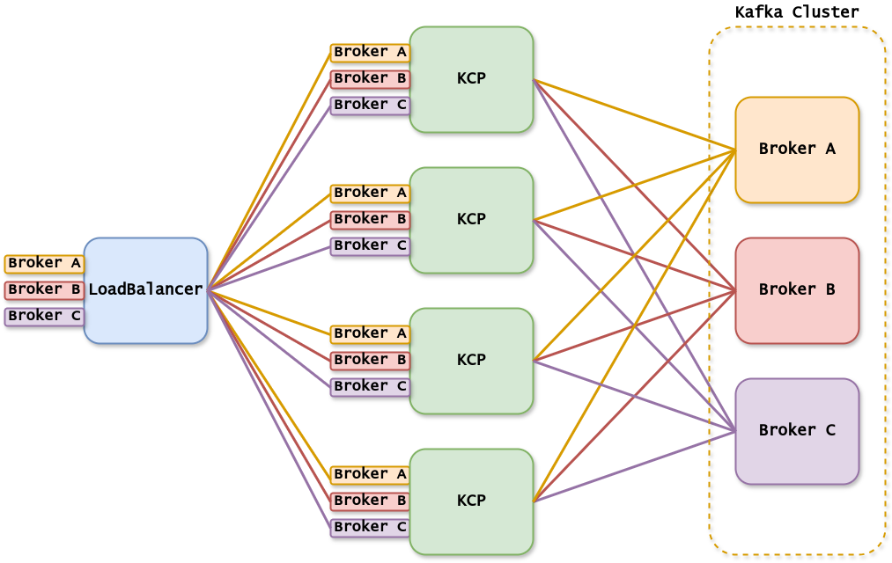
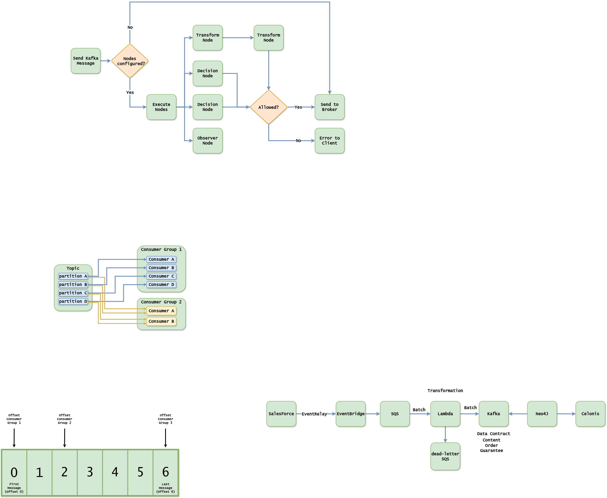

# Kafka Control Proxy (KCP): Protocol-Level Kafka Controls in a Customizable Proxy
--- It's still in development, so the documentation is not complete yet ---

## What is KCP?
KCP is a hackable and reactive intermediate layer to control Kafka traffic. It acts as a lightweight and flexible proxy to enforce Kafka protocol-level controls. 
KCP allows you to intercept, modify, and block Kafka requests and responses based on custom rules. 
Without compromising performance, KCP enforces security, compliance, and operational policies on Kafka traffic. It completely shields Kafka for all actions.

## Why KCP?
Kafka is a distributed streaming platform widely used for building real-time data pipelines and streaming applications. However, Kafka lacks a built-in mechanism to enforce protocol-level controls. 
While some commercial solutions offer these controls, they are not customizable. KCP provides a lightweight and customizable alternative to these commercial solutions.

Some possibilities of KCP include:
- Implementing a software firewall for Kafka to block requests from specific IP addresses based on request content, authenticated user, or Kafka APIKey.
- Enforcing security policies by blocking requests that contain sensitive information.
- Encrypting event fields in Kafka messages, allowing only specific consumers to read certain fields.
- Shielding topic management, including naming standards, settings, and access control.
- Performing schema validation on complete messages.
- Conducting chaos testing by mimicking unstable network conditions, such as delaying, dropping, or reordering messages, to observe application response.

This is created as part of my Master Thesis at the University of Amsterdam, yet to be published.

## How does KCP Work?
Every KCP instance can reach every Kafka broker, for every broker a KCP instance opens a port to listen for incoming connections and forwards them to the right broker.
The load can be equally distributed between the KCP instances by using a load balancer in front of the KCP instances, shown in below image.


All four KCP instances can reach all three brokers. Even if the load balancer equally distributes the connections, the broker used depends on the topic partitions and event key.
Note that four KCP instances are likely overkill, as KCP is lightweight and not the bottleneck. This just demonstrates how the connections work. KCP can scale 
independently of the Kafka cluster.

There are three different Control Nodes in KCP:
- ObserverNode: Observes the Kafka traffic and can be used to log the traffic out of the dataflow
- TransformNode: Can be used to transform the Kafka traffic, for example to encrypt or decrypt the messages
- DecisionNode: Can be used to block or allow the Kafka traffic based on the content of the messages

Before going to Kafka the nodes align themselves according to the following image:


Multiple TransformNodes are sequentially executed, while the DecisionNode are executed in parallel. The ObserverNode is always executed separately of the dataflow.

## Performance
Inserting KCP into the datastream without additional controls adds less than 1ms latency to the Kafka request-response cycle. 
Consequently, end-to-end latency will increase by less than 2ms, as KCP sits in the middle of both PRODUCE and FETCH request-response cycles.
Any additional controls will add latency proportional to their complexity. However, KCP aligns the various control nodes as efficiently as possible.

## Getting Started
First you need a vertx instance, then you can register the created control nodes, and then you can deploy the proxy. This is the minimal configuration shown in the plain example of the `kafka-control-proxy-examples` folder. 

```java
// This is a simple example of a DecisionNode implementation, which logs the request data and always allows the request to proceed.
public class LogDecisionNode implements DecisionNode {
    private static final Logger LOGGER = LoggerFactory.getLogger(LogDecisionNode.class);
    private Vertx vertx;

    @Override
    public LogDecisionNode init(Vertx vertx) {
        this.vertx = vertx;
        return this;
    }

    @Override
    public Future<Boolean> request(RequestHeaderAndPayload request) {

        Context context = this.vertx.getOrCreateContext();
        context.put("TEST", "TEST"); // Context is a shared data structure between the different nodes
        Promise<Boolean> resultPromise = Promise.promise();

        vertx.runOnContext(v -> {
            LOGGER.info("Request: {}", request.request.data());
            resultPromise.complete(true); // Change this to 'false' to see how it blocks the request
        });

        return resultPromise.future();
    }

    @Override
    public Future<Void> response(RequestHeaderAndPayload request, AbstractResponse response) {
        Promise<Boolean> resultPromise = Promise.promise();

        vertx.runOnContext(v -> {
            Context context = this.vertx.getOrCreateContext();
            String test = context.get("TEST"); // Grab the context
            LOGGER.info("Context {} Response: {}", test, response.data());
            resultPromise.complete();
        });

        return Future.succeededFuture();
    }
}
```

```java
public class Main {

    public static void main(String[] args) {
        Vertx vertx = Vertx.vertx();
        registerNode(
                List.of(ApiKeys.values()), //register for all Kafka API keys
                new LogDecisionNode().init(vertx)
        );
        KafkaControlProxy.deploy(vertx);
    }

}
```

## Authentication
KCP works with every authentication mechanism in Kafka, it is simply passing through these messages. In the future it might implement an own authentication mechanism to allow for more fine-grained control without the need
to change the Kafka configuration.

## Configuration
The configuration is done either by environment variables or in the microprofile-config.properties file, according to Smallrye Config. Every '.' or '-' can be replaced by '_' and uppercased when using environment variables. 
For example, `proxy.origin.brokers[i].host` becomes `PROXY_ORIGIN_BROKERS__I_HOST`.

The following properties are available:

### Required
- **proxy.server.port**: Start of the port range for the KCP instances, the range will be proxy.server.port - proxy.server.port + number of brokers
- **proxy.server.host**: The host kcp is reached at, the hosts of the brokers will be transformed to this one. 
- **proxy.origin.brokers[i].host**: The host of the broker i
**proxy.origin.brokers[i].port**: The port of the broker i


### Optional
- **proxy.server.ssl**: Whether the connection from the client to the kcp is with ssl
- **proxy.server.keystore**: The keystore for the connection from the client to the kcp
- **proxy.server.keystore-password**: The password for the keystore

- **proxy.origin.tcp-client.ssl**: Whether connection from kcp to the broker is with ssl
- **proxy.origin.tcp-client.truststore**: The truststore for the connection from kcp to the broker
- **proxy.origin.tcp-client.truststore-password**: The password for the truststore

## Maven

To use this project in your own project, you can add the following dependency to your pom.xml with the usage of jitpack.io:

```xml
<repositories>
    <repository>
        <id>jitpack.io</id>
        <url>https://jitpack.io</url>
    </repository>
</repositories>
```
```xml
<dependencies>
    <dependency>
        <groupId>com.github.Spanjer1.kafka-control-proxy</groupId>
        <artifactId>kafka-control-proxy</artifactId>
        <version>v0.0.1</version>
    </dependency>
</dependencies>
```

the packages are available under the 'nl.reinspanjer.kcp.*' namespace.

Publishing it to the Maven Central Repository is still in progress.

