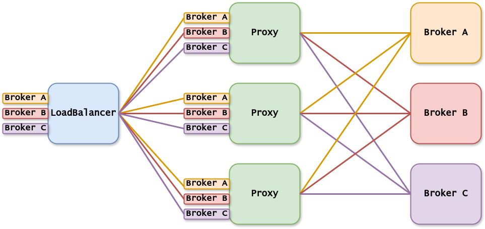

# Kafka Control Proxy: Protocol-Level Kafka Controls in a Customizable Proxy

## What is Kafka Control Proxy (KCP)?
KCP is a hackable and reactive intermediate layer to control Kafka traffic. It acts as a lightweight and flexible proxy to enforce Kafka protocol-level controls. 
KCP allows you to intercept, modify, and block Kafka requests and responses based on custom rules. 
Without compromising performance, KCP enforces security, compliance, and operational policies on Kafka traffic. It completely shields Kafka for all actions.

## Why Kafka Control Proxy?
Kafka is a distributed streaming platform widely used for building real-time data pipelines and streaming applications. However, Kafka lacks a built-in mechanism to enforce protocol-level controls. 
While some commercial solutions offer these controls, they are not customizable. KCP provides a lightweight and customizable alternative to these commercial solutions.

Some possibilities of KCP include:
- Implementing a software firewall for Kafka to block requests from specific IP addresses based on request content, authenticated user, or Kafka APIKey.
- Enforcing security policies by blocking requests that contain sensitive information.
- Encrypting event fields in Kafka messages, allowing only specific consumers to read certain fields.
- Shielding topic management, including naming standards, settings, and access control.
- Performing schema validation on complete messages.
- Conducting chaos testing by mimicking unstable network conditions, such as delaying, dropping, or reordering messages, to observe application response.

This is created as part of my Master Thesis at the University of Amsterdam, yet to be published.

## How Kafka Control Proxy Works?
Every KCP instance can reach every Kafka broker, for every broker a KCP instance opens a port to listen for incoming connections and forwards them to the right broker.
The load can be equally distributed between the KCP instances by using a load balancer in front of the KCP instances, shown in below image.

All 4 kcp instances can reach all three brokers. So even if the load balancer equally distributes the connections, which broker it will be used is part of the partitions of the topic.

## Performance
Inserting KCP into the datastream without additional controls adds less than 1ms latency to the Kafka request-response cycle. 
Consequently, end-to-end latency will increase by less than 2ms, as KCP sits in the middle of both PRODUCE and FETCH request-response cycles.
Any additional controls will add latency proportional to their complexity. However, KCP aligns the various control nodes as efficiently as possible.

## Getting Started

## Authentication
KCP works with every authentication mechanism in Kafka, it is simply passing through these messages. In the future it might implement an own authentication mechanism to allow for more fine-grained control without the need
to change the Kafka configuration.

